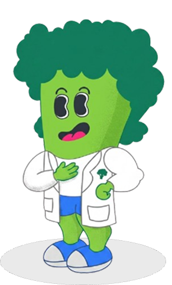
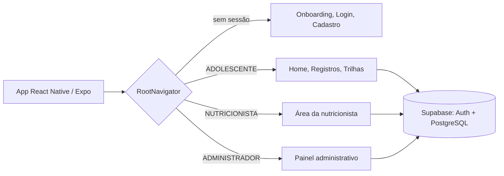

<div align="center">



# NutriTeens

**Aplicativo móvel para apoiar a alimentação saudável de adolescentes, com base no Guia Alimentar para a População Brasileira.**


</div>

---

> ### 🚧 Projeto em andamento
> O NutriTeens é um **projeto de pesquisa em desenvolvimento**. O que está aqui é um **MVP (Produto Mínimo Viável)**: uma primeira versão funcional que implementa **apenas parte** das funcionalidades especificadas. Ainda **não foi avaliado com usuários** (testes de usabilidade com adolescentes e avaliação com professores e nutricionista estão previstos para as próximas etapas). Funcionalidades, telas e estrutura do banco podem mudar a qualquer momento.

## 📖 Sobre o projeto

O excesso de peso e a obesidade na adolescência são um problema de saúde pública. O [Guia Alimentar para a População Brasileira](https://bvsms.saude.gov.br/bvs/publicacoes/guia_alimentar_populacao_brasileira_2ed.pdf) é a principal referência em Educação Alimentar e Nutricional (EAN), mas o seu formato e a sua linguagem pouco atraem os adolescentes.

O **NutriTeens** propõe levar as orientações do Guia para o cotidiano de adolescentes do Ensino Fundamental II, por meio de um aplicativo que combina **registro de hábitos**, **educação alimentar**, **gamificação** e **feedback sem julgamento**, sem contagem calórica rígida, sem rankings e sem comparação entre usuários.

A solução foi concebida com **Design Centrado no Usuário** e **Design Participativo**: adolescentes de uma escola pública e de uma privada de Viçosa-MG, professores e uma nutricionista participaram da criação das alternativas de design. O resultado dessas sessões é o **Modelo Conceitual NutriTeens**, que orienta o desenvolvimento:

| Dimensão | Ideia central |
|---|---|
| **Engajamento** | Gamificação significativa, autonomia e personalização |
| **Aprendizagem** | Educação nutricional contextualizada e feedback contínuo |
| **Socialização** | Interação social positiva entre pares |
| **Contextualização** | Linguagem juvenil, contexto escolar, validação nutricional e múltiplos *stakeholders* |

> ⚠️ **Aviso:** o NutriTeens é uma "companheira de jornada" educativa. Ele **não** faz diagnóstico nutricional, **não** prescreve dietas e **não** substitui o acompanhamento de profissionais de saúde.

## ✨ Funcionalidades

### Já implementadas no MVP

- **🔐 Acesso e conta:** cadastro, login, recuperação e redefinição de senha, com perfis de **adolescente**, **nutricionista** e **administrador**.
- **👋 Onboarding:** apresentação do app em slides e etapas de cadastro.
- **📝 Triagem inicial:** *recordatório alimentar* (marcadores de consumo do SISVAN) e perguntas da **Escala Brasileira de Insegurança Alimentar (EBIA)**, para conhecer o contexto do adolescente.
- **🏠 Home:** saudação, seletor de semana, **missão do dia**, **sequência de dias (streak)** com tela de celebração e o mascote **Broxis**.
- **💧 Água:** registro do consumo com garrafa animada e meta diária calculada.
- **🍽️ Alimentação:** busca de alimentos, cadastro de novos alimentos e pratos, registro por tipo de refeição e **feedback qualitativo da refeição** (processamento, diversidade de grupos e nutrientes), com linguagem calibrada pela EBIA para evitar tom de cobrança. Inclui **receitas com guia visual passo a passo**.
- **🏃 Atividade física:** busca e registro de atividades.
- **🎓 Trilhas de aprendizagem:** módulos e lições com exercícios interativos (múltipla escolha, verdadeiro ou falso, completar frase, associar, ordenar e classificar).
- **🛠️ Painel administrativo:** gestão do catálogo de alimentos, usuários e métricas.

### Em desenvolvimento / apenas especificadas

Estas funcionalidades constam na especificação do sistema, mas **ainda não estão prontas** (algumas telas existem só como espaço reservado):

- Espaço social moderado (compartilhamento voluntário, sem rankings ou métricas comparativas)
- Assistente conversacional de escopo restrito
- Área da nutricionista (revisão e validação de conteúdos)
- Lembretes e alarmes de refeição e hidratação
- Identificação assistida de alimentos por câmera (prevista como versão futura, sob validação técnica)
- Termos de uso e política de privacidade em linguagem acessível
- Personalização de orientações e desafios a partir do perfil da triagem

## 📸 Telas

<!-- Adicione as capturas de tela em docs/screenshots/ e ajuste os caminhos abaixo. -->

| Apresentação | Recordatório | Registro de água | Feedback da refeição | Trilhas |
|:---:|:---:|:---:|:---:|:---:|
| *(em breve)* | *(em breve)* | *(em breve)* | *(em breve)* | *(em breve)* |

## 🧰 Tecnologias

| Camada | Tecnologias |
|---|---|
| **App** | [React Native](https://reactnative.dev/) 0.81 + [Expo](https://expo.dev/) SDK 54, TypeScript |
| **Navegação** | React Navigation (native stack) |
| **Estado e dados** | TanStack Query, Zustand, React Hook Form + Zod |
| **Interface e animações** | Reanimated, Moti, Lottie, SVG, confetti, fonte [Sora](https://fonts.google.com/specimen/Sora) |
| **Backend** | [Supabase](https://supabase.com/) (autenticação e PostgreSQL) |
| **Testes** | Jest + ts-jest (configurados; **ainda sem testes escritos**) |

## 🏗️ Arquitetura

O app é organizado por **funcionalidade** (`features`), com componentes, serviços e telas de cada área juntos. Após o login, a navegação muda conforme o **papel** do usuário e a **etapa de onboarding** salvos na tabela `profiles`.



Fluxo de onboarding do adolescente: **Apresentação → Cadastro → Triagem (recordatório + EBIA) → Orientações → Concluído**.

<details>
<summary><b>📂 Estrutura de pastas</b></summary>

```
nutriteens-mobile/
├── assets/                 # fontes (Sora), imagens, mascote Broxis
├── scripts/
│   ├── seed-taco/          # importa dados nutricionais (TACO) para o banco
│   └── seed-trilha/        # cria a estrutura inicial da trilha de aprendizagem
├── src/
│   ├── features/
│   │   ├── adolescente/    # água, alimentação, atividade física, home,
│   │   │                   # perfil, social, triagem (EBIA e recordatório), trilha
│   │   ├── admin/          # alimentos, usuários e métricas
│   │   ├── auth/           # login, cadastro, apresentação, recuperação de senha
│   │   ├── legal/          # termos e política de privacidade (espaço reservado)
│   │   └── nutricionista/  # área da nutricionista (espaço reservado)
│   ├── lib/                # cliente do Supabase
│   ├── navigation/         # navegadores por papel de usuário
│   └── shared/             # contextos, UI, tema, hooks e utilitários
├── index.ts
└── package.json
```

</details>

## 🚀 Como executar

### Pré-requisitos

- [Node.js](https://nodejs.org/) 20 ou superior
- Um projeto no [Supabase](https://supabase.com/) (o app depende dele para autenticação e dados)
- Aplicativo **Expo Go** no celular, ou um emulador Android/iOS

### Passo a passo

```bash
# 1. Clone o repositório
git clone [LINK DO REPOSITÓRIO]
cd nutriteens-mobile

# 2. Instale as dependências
npm install

# 3. Configure as variáveis de ambiente (veja abaixo)

# 4. Inicie o app
npm start
```

Atalhos: `npm run android`, `npm run ios` e `npm run web`.

### Variáveis de ambiente

Crie um arquivo `.env` na raiz do projeto com a URL e a chave **anônima (anon)** do seu projeto Supabase (*Project Settings → API*):

```env
EXPO_PUBLIC_SUPABASE_URL=https://SEU-PROJETO.supabase.co
EXPO_PUBLIC_SUPABASE_ANON_KEY=sua-chave-anon
```

> 🔒 **Nunca** coloque a chave `service_role` no app nem no repositório. Ela só deve ser usada nos scripts de *seed*, localmente, e nunca deve ser versionada.

### Banco de dados

O banco é PostgreSQL no Supabase. Os scripts SQL de migração e de carga inicial ficam junto das funcionalidades que os usam, por exemplo em `src/features/adolescente/triagem/recordatorio/data/` e `src/features/adolescente/trilha/data/`. **O esquema completo ainda não está documentado neste repositório.** Tabelas como `profiles`, `alimentos`, `refeicoes`, `receitas`, `missoes_diarias`, `avaliacoes_ebia` e `xp_usuario` são usadas pelo app.

### Carga de dados (seeds)

Crie um `.env.seed` na raiz (também **não versionado**):

```env
SUPABASE_URL=https://SEU-PROJETO.supabase.co
SUPABASE_SERVICE_ROLE_KEY=chave-service-role
TRILHA_CRIADO_POR=id-de-um-perfil-administrador
TRILHA_TEMA=tema-da-trilha
```

```bash
# Dados nutricionais da TACO (597 alimentos do dataset local)
npx ts-node -r dotenv/config scripts/seed-taco/seedTaco.ts dotenv_config_path=.env.seed

# Estrutura inicial da trilha de aprendizagem
node scripts/seed-trilha/seedTrilhaInicial.cjs
```

### Testes

O Jest já está configurado (`npm test`), mas **ainda não há testes automatizados escritos**. É uma das próximas tarefas.

## 🗺️ Próximos passos

- [ ] Concluir os requisitos de privacidade e consentimento (termos e política de privacidade)
- [ ] Implementar as funcionalidades sociais e o assistente de escopo restrito
- [ ] Construir a área da nutricionista e a validação de conteúdos
- [ ] Adicionar testes automatizados
- [ ] Realizar avaliações de usabilidade com adolescentes e avaliação com professores e nutricionista
- [ ] Documentar o esquema do banco de dados
- [ ] Refinar o app a partir dos resultados das avaliações

## 🔬 Contexto da pesquisa

O NutriTeens é desenvolvido na **Universidade Federal de Viçosa (UFV)**, no Departamento de Informática, como projeto de Iniciação Científica (**PIBIC/CNPq**), em colaboração com o Departamento de Nutrição e Saúde.

- 🎨 **Protótipo unificado de baixa fidelidade (Figma):** [abrir protótipo](https://www.figma.com/design/Ckl9eni0Mxqnb0QPM0pmhx/IIRE_2026?node-id=0-1&t=lJZu1jk4vyoPmUJK-1)
- 📄 **Artigo:** *Cocriando um Aplicativo Móvel para Alimentação Saudável com Adolescentes: Percepções de Sessões de Design Participativo* (IHC 2026)
- ⚖️ **Ética:** pesquisa aprovada pelo Comitê de Ética em Pesquisa da UFV (CAAE 94172425.4.0000.5153). Dados de participantes **não** fazem parte deste repositório.

## 👥 Equipe

| | Papel |
|---|---|
| **Gustavo Santos Pinto** | Bolsista de Iniciação Científica, desenvolvimento e pesquisa |
| **Maria Lúcia Bento Villela** | Orientadora (Departamento de Informática, UFV) |
| **Ana Elisa Silva Pinto** e **Isabela Cristina da Silva Nascimento** | Colaboração em Nutrição (Departamento de Nutrição e Saúde, UFV) |

## 🙏 Agradecimentos

- **CNPq**, pela bolsa de Iniciação Científica.
- Às **escolas, professores, nutricionista e adolescentes** que participaram das sessões de Design Participativo.
- À **Tabela Brasileira de Composição de Alimentos (TACO)**, cujos dados nutricionais são usados no app (dataset local baseado em [marcelosanto/tabela_taco](https://github.com/marcelosanto/tabela_taco)).
- À família tipográfica **Sora**.

## 📄 Licença

Distribuído sob a licença **MIT**. Veja o arquivo [LICENSE](LICENSE) para mais detalhes.

---

<div align="center">
Feito com 💚 na UFV · <i>Projeto em andamento</i>
</div>
